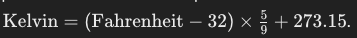
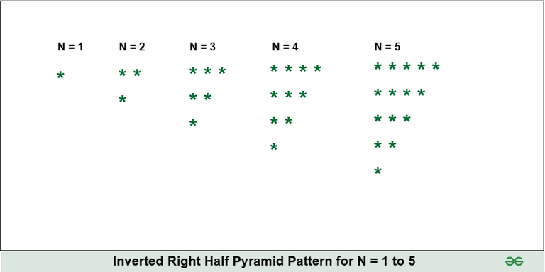

# C++ Programming For Science - Midterm Exam

This template repository is the starter project for C++ Programming For Science Midterm Exam. Written in C++, and tested with CMake/Catch2.

### Question(s)

**Your solutions for all questions should be dynamic and pass additional (hidden) testcases as long as they are following the question description.**  

1. **(%20)** Write a C++ function to convert Fahrenheit to Kelvin. The formula is as follows:  

2. **(%20)** Write a C++ function to check if a given number is a prime number or not.  

A prime number is a number that is only divisible by one and itself e.g. 17 is a prime number because it is only divisible by 1 and 17.  

15 is not a prime number because it is divisible by 1, 3, 5 and 15.  

3. **(%20)** Write a C++ function to calculate the sum of all prime numbers up to a given limit.  

4. **(%20)** Write a C++ function to reverse a given integer.  

5. **(%20)** Write a C++ function to print an inverted half star pyramid pattern. The output should look like this:  

  

### Setup Command

`make clean`

### Run Command

`make test`